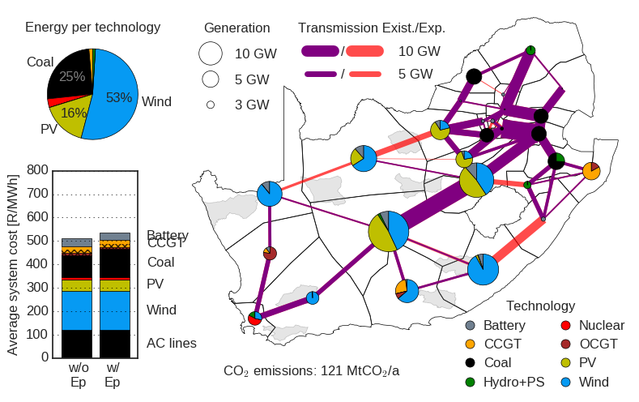

# PyPSA-ZA

[PyPSA](https://pypsa.org/) model of the South African electricity system at the level of ESKOM's supply regions.



The model is described and evaluated in the paper [PyPSA-ZA: Investment and operation co-optimization of integrating wind and solar in South Africa at high spatial and temporal detail](https://arxiv.org/abs/1710.11199), 2017, [arXiv:1710.11199](https://arxiv.org/abs/1710.11199).

This repository contains the scripts to automatically reproduce the analysis.

## Instructions

To build and solve the model, a computer with about 20GB of memory with a strong
interior-point solver supported by the modelling library
[PYOMO](https://github.com/Pyomo/pyomo) like Gurobi or CPLEX are required.

We recommend as preparatory steps (the path before the `%` sign denotes the
directory in which the commands following the `%` should be entered):

1. cloning the repository using `git` (**to a directory without any spaces in the path**)
   ```shell
   /some/other/path % cd /some/path/without/spaces
   /some/path/without/spaces % git clone https://github.com/FRESNA/pypsa-za.git
   ```

2. installing the necessary python dependencies using conda (from within the `pypsa-za` directory)
   ```shell
   .../pypsa-za % conda env create -f environment.yaml
   .../pypsa-za % source activate pypsa-za  # or conda activate pypsa-za on windows
   ```

3. getting the separate [data bundle](https://vfs.fias.science/d/f204668ef2/files/?p=/pypsa-za-bundle.7z&dl=1) (see also [Data dependencies] below) and unpacking it in `data`
   ```shell
   .../data % wget "https://vfs.fias.science/d/f204668ef2/files/?dl=1&p=/pypsa-za-bundle.7z"
   .../data % 7z x pypsa-za-bundle.7z
   ```

All results and scenario comparisons are reproduced using the workflow
management system `snakemake`
```shell
.../pypsa-za % snakemake
[... will take about a week on a recent computer with all scenarios ...]
```

`snakemake` will first compute several intermediate data files in the directory
`resources`, then prepare unsolved networks in `networks`, solve them and save
the resulting networks in `results/version-0.x/networks` and finally render the
main plots into `results/version-0.5/plots`.

Instead of computing all scenarios (defined by the product of all wildcards in
the `scenario` config section), `snakemake` also allows to compute only a
specific scenario like `csir-aggressive_redz_E_LC`:
```shell
.../pypsa-za % snakemake results/version-0.5/plots/network_csir-aggressive_redz_E_LC_p_nom
```

## Data dependencies

For ease of installation and reproduction we provide a bundle
[`pypsa-za-bundle.7z`](https://vfs.fias.science/d/f204668ef2/files/?p=/pypsa-za-bundle.7z&dl=1)
with the necessary data files:

| File                                               | Citation                                                                                                                                                                                                       |
|----------------------------------------------------|---------------------------------------------------------------------------------------------------------------------------------------------------------------------------------------------------------------|
| South_Africa_100m_Population                       | WorldPop, South Africa 100m Population (2013). [doi:10.5258/soton/wp00246](https://doi.org/10.5258/soton/wp00246)                                                                                             |
| Supply area normalised power feed-in for PV.xlsx   | D. S. Bofinger, B. Zimmermann, A.-K. Gerlach, D. T. Bischof-Niemz, C. Mushwana, [Wind and Solar PV Resource Aggregation Study for South Africa](https://www.csir.co.za/csir-energy-centre-documents). (2016). |
| Supply area normalised power feed-in for Wind.xlsx | same as above                                                                                                                                                                                                 |
| EIA_hydro_generation_2011_2014.csv                 | U.S. EIA, [Hydroelectricity Net Generation ZA and MZ 2011-2014](http://tinyurl.com/EIA-hydro-gen-ZA-MZ-2011-2014) (2017).                                                                                     |
| Existing Power Stations SA.xlsx                    | Compiled by CSIR from [Eskom Holdings](https://www.eskom.co.za/) (Jan 2017) and RSA DOE, [IRP2016](http://www.energy.gov.za/IRP/2016/Draft-IRP-2016-Assumptions-Base-Case-and-Observations-Revision1.pdf)     |
| Power_corridors                                    | RSA DEA, [REDZs Strategic Transmission Corridors](https://egis.environment.gov.za/) (Apr 2017)                                                                                                                |
| REDZ_DEA_Unpublished_Draft_2015                    | RSA DEA, [Wind and Solar PV Energy Strategic Environmental Assessment REDZ Database](https://egis.environment.gov.za/) (Mar 2017)                                                                             |
| SACAD_OR_2017_Q2                                   | RSA DEA, [South Africa Conservation Areas Database (SACAD)](https://egis.environment.gov.za/) (Jun 2017)                                                                                                      |
| SAPAD_OR_2017_Q2                                   | RSA DEA, [South Africa Protected Areas Database (SAPAD)](https://egis.environment.gov.za/) (Jun 2017)                                                                                                         |
| SystemEnergy2009_13.csv                            | Eskom, System Energy 2009-13 Hourly, available from Eskom on request                                                                                                                                          |
| SALandCover_OriginalUTM35North_2013_GTI_72Classes  | GEOTERRAIMAGE (South Africa), [2013-14 South African National Land-Cover Dataset](https://egis.environment.gov.za/data_egis/node/109) (2017)                                                                  |

